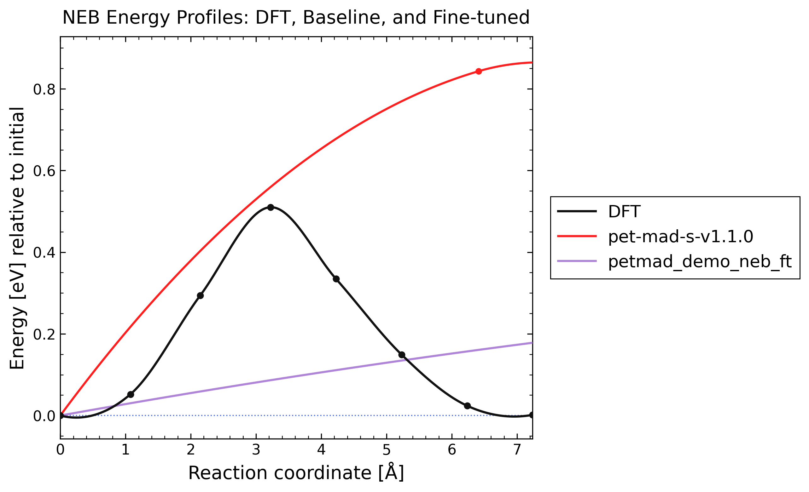
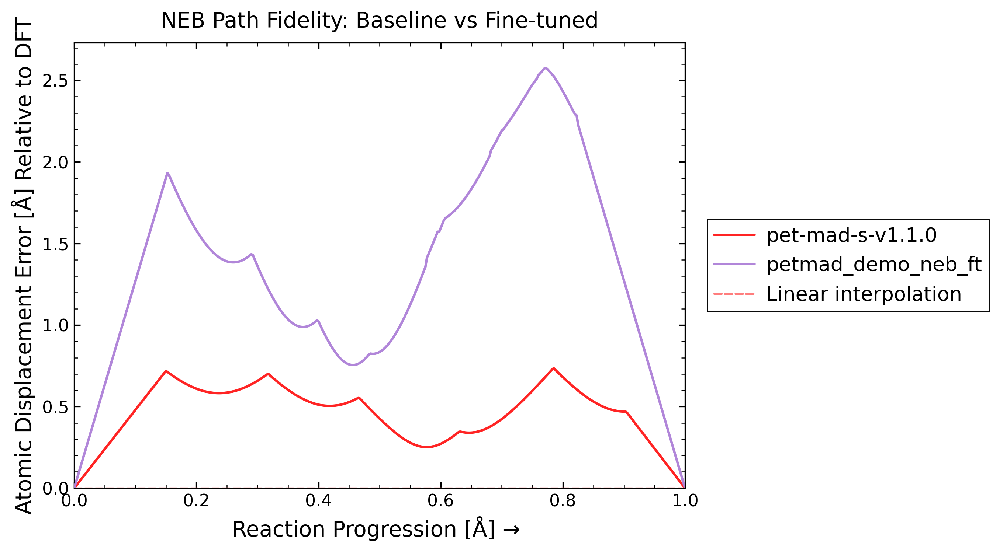

# PET-MAD Workflow

This example follows one raw NEB problem all the way through curation,
fine-tuning a downloaded PET-MAD checkpoint, and a final benchmark that
compares the original model against the fine-tuned one on the same endpoints.

Step flow:

- `0_raw_inputs/` contains the raw NEB bundle and the `siv_rules.yml` file
  that defines the curation job
- `1_curated_data/` receives the curated `extxyz` splits written by
  `mlip-ft`
- `2_train/` contains the launcher that reads those curated splits and runs
  native metatrain PET LoRA fine tuning
- `3_results/` collects the exported model and checkpoint outputs
- `4_benchmark/` compares `pet-mad-s-v1.1.0` against `petmad_demo_neb_ft`
  on the raw NEB pathway from `0_raw_inputs/output1`

Run curation from the repo root with:

```bash
mlip-ft petmad --curate-neb --inputs demo/fine_tuning/petmad/0_raw_inputs/siv_rules.yml
```

That command reads `demo/fine_tuning/petmad/0_raw_inputs/siv_rules.yml` and
writes the curated `extxyz` files into:

```text
demo/fine_tuning/petmad/1_curated_data/
```

Run training with:

```bash
./demo/fine_tuning/petmad/2_train/run_fine_tuning.sh
```

That launcher reads the curated `extxyz` files from
`demo/fine_tuning/petmad/1_curated_data/` and writes all outputs into:

```text
demo/fine_tuning/petmad/3_results/
```

On first run, the launcher downloads the PET-MAD fine-tuning checkpoint:

```text
demo/fine_tuning/petmad/3_results/pet-mad-v1.1.0.ckpt
```

The default PET-MAD training config uses metatrain PET LoRA:

```yaml
finetune:
  method: lora
  config:
    rank: 8
    alpha: 8
    target_modules:
      - input_linear
      - output_linear
```

Full fine tuning is preserved as an expert alternate:

```bash
./demo/fine_tuning/petmad/2_train/run_full_fine_tuning.sh
```

After training, append the fine-tuned model name and its environment to
`SUPPORTED_MODELS.yml` for later benchmarking. The entry for this workflow is:

```yaml
petmad_demo_neb_ft:
  environment: mace_env
```

Then place the final PET-MAD model file where the calculator registry looks
for UPET/PET-MAD models:

```text
assets/models/petmad/upet/
```

The benchmark step uses the raw NEB images from:

```text
demo/fine_tuning/petmad/0_raw_inputs/output1/00/POSCAR
demo/fine_tuning/petmad/0_raw_inputs/output1/07/POSCAR
```

It does not relax endpoints. The benchmark config lives in
`demo/fine_tuning/petmad/4_benchmark/config.yml`, and the ordinary command is:

```bash
mlip-neb --inputs demo/fine_tuning/petmad/4_benchmark
```

The benchmark section below is generated automatically by
`mlip-neb --inputs demo/fine_tuning/petmad/4_benchmark --report-benchmark`.

## Benchmark Report
<!-- MLIP_BENCHMARK_START -->

The benchmark compares the baseline and fine-tuned models on the raw NEB input from `0_raw_inputs/output1`.

Command:

```bash
mlip-neb --inputs demo/fine_tuning/petmad/4_benchmark --report-benchmark
```

Compared models:

- baseline: `pet-mad-s-v1.1.0`
- fine-tuned: `petmad_demo_neb_ft`

Metrics:

| Model | Energy barrier abs err [eV] | Delta E abs err [eV] | Energy profile RMSE [eV] | Mean RMS displacement [A] | Max RMS displacement [A] | AUC RMS displacement [A] |
| --- | ---: | ---: | ---: | ---: | ---: | ---: |
| pet-mad-s-v1.1.0 | 0.333058 | 0.007339 | 0.451713 | 0.460129 | 0.735111 | 0.461280 |
| petmad_demo_neb_ft | 0.144943 | 0.002456 | 0.212388 | 1.359942 | 2.575203 | 1.363342 |

Plots:

### Energy



### Path fidelity



[Report](4_benchmark/plot/report.md)

<!-- MLIP_BENCHMARK_END -->
